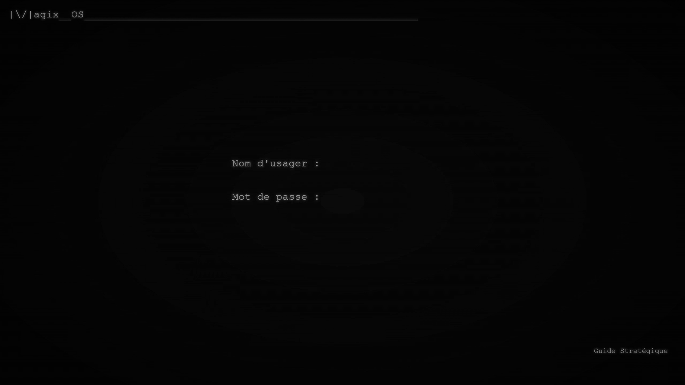

<h1>|\/|agix__OS</h1>
 

<h1></h1>
<h2>Présentation Générale</h2>

Comme ce projet est un front-end à l'API de MAGIX, mon objectif à été de faire comme si c'était un système d'exploitation d'où la partie «OS» au titre. Mon inspiration pour l'apparence est basée sur de vieux système d'exploitation en ligne de commande avec une touche de moderne. Pour reproduire le sentiment de l'époque, j'ai tenté de reproduire l'effet d'un écran cathodique en appliquant un filtre scanline sur toute la page. De plus, si on est attentif on pourra observer des variations de luminosité -- plus visible sur le texte -- rappelant l'apparence dansante de ces écrans.

<h2>Navigation</h2>

Il y a 6 pages différentes:

<li>index.php</li>
<li>login.php</li>
<li>home.php</li>
<li>game.php</li>
<li>deckMaster.php</li>
<li>guide.php</li>
 
<h3>index.php</h3>

On est dans le mode écran de veille. On peut intérragir avec la page en bougeant la souris dans différentes partie de la fenêtre pour changer la direction des étoiles. Plus on est dans un coin, plus les étoiles bouge vite dans cette direction. Comme pour les écrans de veille traditionnels, quand on pèse sur une touche du clavier ou qu'on clique quelque part sur la page on sort du mode. Si on est connecté on est dirigé vers home.php, sinon on est dirigé vers login.php. L'écran de veille est activé après 5 minutes d'inactivité sur toutes les pages à part celle de game.php.

<h3>login.php</h3>

La page de login malgré son apparence simpliste est particulière, puisque c'est de là que j'ai établis le style et l'atmostphère global de |\/|agix__OS. Ainsi on peut observer le fond d'écran clairement et voir l'effet arrondi qui ajoute à la simulation de l'écran cathodique.

Vous pourrez constater que malgré le formulaire pour envoyer nos informations de connexion, il n'y a pas de bouton envoyer comme ce serait le cas dans un système strictement en ligne de commande. C'est-à-dire que vous devez pesez sur la touche « enter » du clavier.

Vous pouvez aussi accéder à la page du guide stratégique en cliquant sur le liens situé le coin inférieur droit. Si vous accédez au guide stratégique par ce liens, vous êtes considéré comme un invité et vous ne pourrez pas écrire d'article. Cependant, vous pourrez consulter ceux existant et y écrire des commentaires.

<h3>home.php</h3>
<h4>Barre d'accès</h4>

    La page d'accès pour tout les services que |\/|agix__OS offre.  
    Dans la barre de gauche vous allez trouver tous les liens pour accéder aux différentes parties du système.   
    Les trois premier mène à game.php:
    <li>__Jouer -> Partie contre un autre joueur</li>
    <li>__Pratiquer -> Partie contre l'ordinnateur</li>
    <li>__Observer -> Observer une partie du point de vue d'un joueur qu'on choisit</li> 
    <li>__Deck_Master -> Permet de faire des modifications à son jeu de carte</li>
    <li>__Guide__Stratégique -> Permet de créer des articles </li>
    <li>__Écran__de__Veille -> Permet d'activer l'écran de veille</li>
    <li>__Quitter -> Permet de se déconnecter en détruisant la clef de session de l'API et celle du serveur PHP</li>

<h4>Section chat et messages système</h4>

    À droite en proéminence le chat et en dessous les messages du systèmes. La zone de messages du système est là pour afficher quelques informations sur le joueur connecté:
    <li>L'heure de sa dernière connexion</li>
    <li>Le résultat de la dernière partie</li>
    <li>Le nombre de partie gagnée</li>
    <li>Le nombre de partie perdue</li>
    <li>Le nombre de trophée </li>

<h4>Fonctionnement Action</h4>

Pour faire la sélection d'un mode de jeu, nous envoyons une requête «GET» avec une clef. Cette clef est évaluée dans homeAction et dépendemment de celle-ci on sera redirigé vers le mode de jeu approprié. Pour la section où nous extrayons les données pour les messages systèmes nous avons porté une attention particulière à la séparation MVC et au lieu d'afficher directement avec php nous utilisons JavaScript pour le faire.

<h3>deckmaster.php</h3>

La page deckMaster contient deux Iframes communiquant avec l'API. Le premier est celui du chat comme pour la page home.php et game.php, nous pouvons sur cette page le cacher ou l'afficher à notre guise. Au centre, nous avons l'autre Iframe permettant de modifier notre jeu de carte.

<h3>guide.php</h3>

Sur cette page nous pouvons écrire des articles en interragissant avec une base de donnée Mysql. Au centre de la page est chargé par défaut l'article le plus récent créé ou modifié. À droite, nous avons la liste de tout les articles en ordre antéchronologique.

Si l'utilisateur est authentifié au travers de l'API, il a la possibilité d'ajouter, de modifier ou d'effacer les articles. Si l'utilisateur est un invité il peut seulement écrire des commentaires. Les commentaires sont permanent à chaque article. C'est-à-dire qu'on ne pourra les effacer que si on efface un article. Ce choix est par design.

<h4>Le fonctionnement</h4>

Tous les boutons sont des formulaire qui envoient des données en «GET» lorsqu'on pèse dessus. Seul les boutons «créer» et «modifer» modifie la page sur le champs sans automatiquement envoyer de formulaire. Donc si on pèse sur un des deux on modifie le contenu pour afficher des formulaires soit de création, soit de modification. Si on est dans le mode «modifier» les champs «textarea» sont préremplient avec le contenu de l'article. Enfin, on peut retourner à l'état précédant en appuyant sur «annuler».  

Une autre spécification, avant d'envoyer l'information entrée (commentaire ou article), nous encodons dans le serveur PHP à l'aide de «htmlentities» les guillemets simple ou double. La raison pour laquelle nous faisons ça c'est pour éviter que le contenu des articles ou des commentaires interfère avec le code html de la page. Dans un des cas avant de faire la modification, la fonction «modifyArticle» ne fonctionnait pas puisque le guillemets fermaient au mauvais endroit empêchant l'exécution du code. De plus, cela «devrait» ajouter un peu plus de protection contre les injections SQL.

<h3>game.php</h3>

Sur la barre de gauche nous avons les détails de la classe et du talent choisit. En dessous, nous avons les statistiques du joueur. Sur cette même barre nous avons aussi le chat. À droite, nous avons la zone de jeu et au dessus les status de l'ennemie. Au centre, la plateforme du jeu et en dessous les éléments du joueur.

 
 
 

<footer>
Note**
 
 
Navigation générale -> la barre de titre dans les pages __Deck_Master et __Guide_Stratégique dirige à home.php.
</footer>